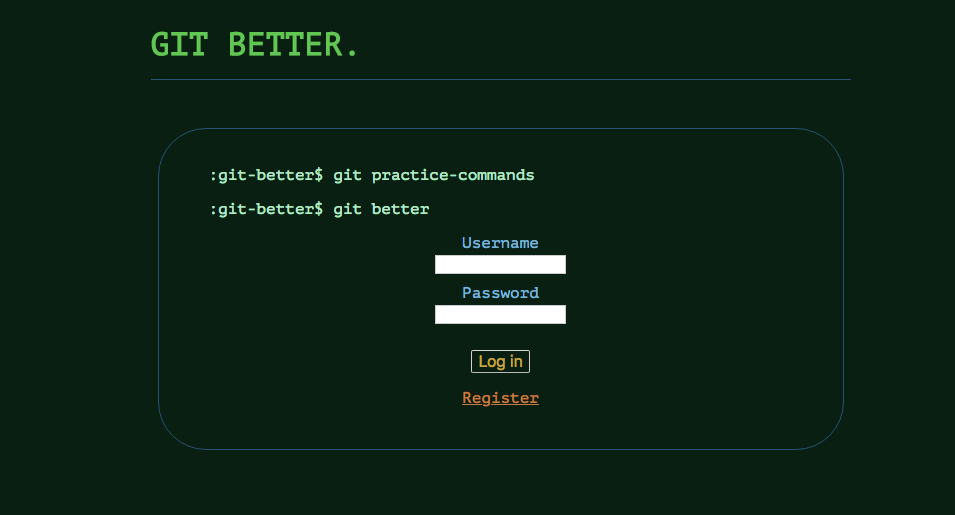
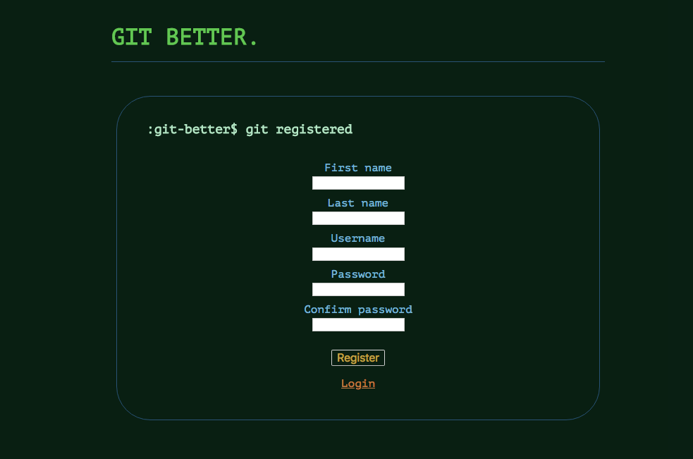
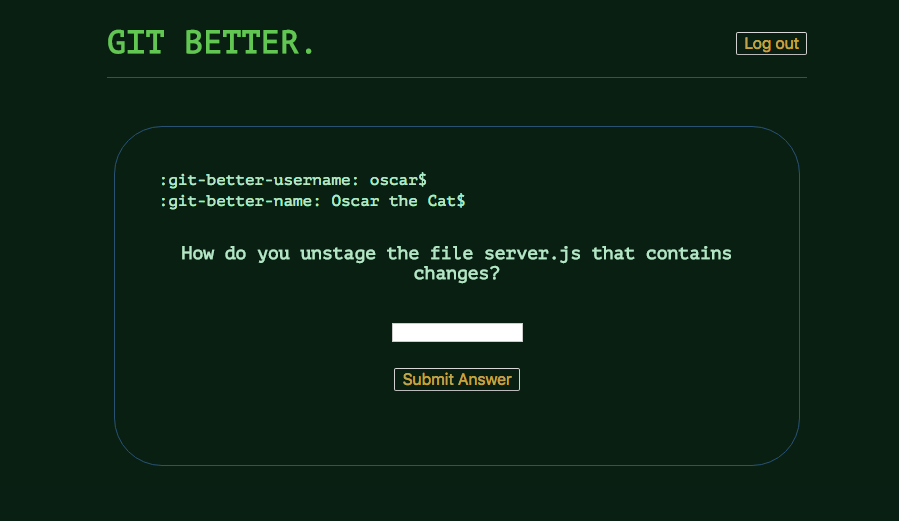
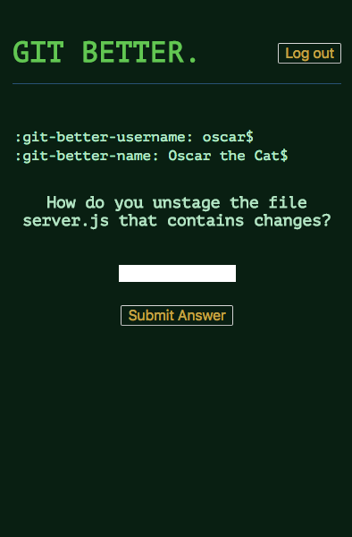
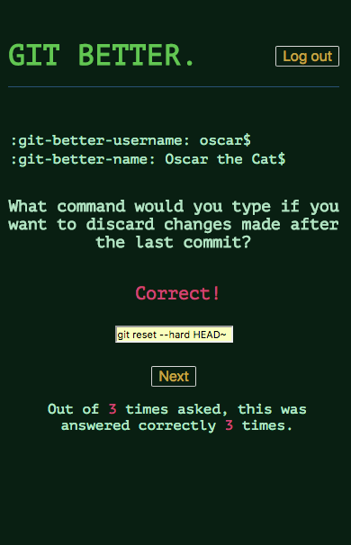
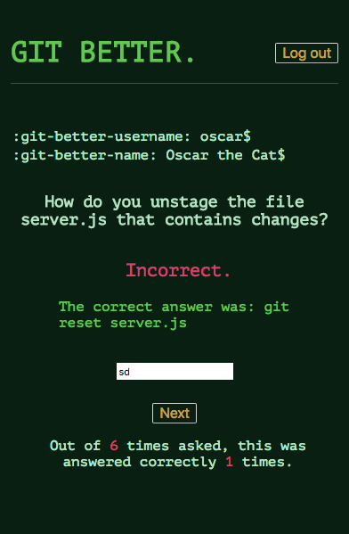

---
# GIT BETTER
---

A learning tool for practicing git commands.
  - Practice 10 Git Commands
  - Pick-up where you left off
  - See problematic questions more often.  

---
## Links
---
  - See the app live at: https://cranky-jackson-36d9ef.netlify.com
  - View the Client Repo: https://github.com/ASTribble/git-better-spacedRepetition-client
  - View the Server Repo: https://github.com/YourWebDevGuy/git-better-spacedRepetition-server
  - Server hosted at: http://git-better-server.herokuapp.com

---
## Screenshots
---

### Larger Screen Views:

#### Landing Page:

#### Registration Page:

#### Question View:

### Mobile Views:

#### Question View:

#### Feedback View for Correct Answers:

#### Feedback View for Incorrect Answers:

---
## Technology Stack
---

### Front-end technologies​
- Javascript, CSS, HTML
- REACT with Redux

### Server Technologies
- Node.js
- Express

### Authentication
- Bcrytp.js
- Passport
- jsonwebtoken

### Data Persistence
- ​Mongo
- Mongoose

### Hosting/Saas
- mLab
- netlify

### ​Development Environment
- VSC, git, Github

